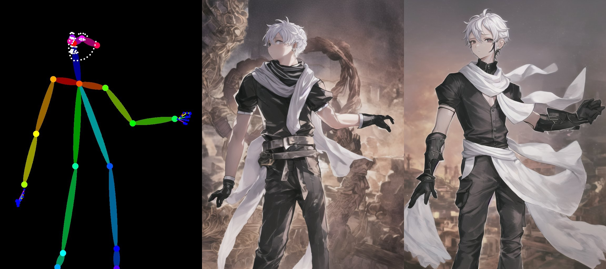
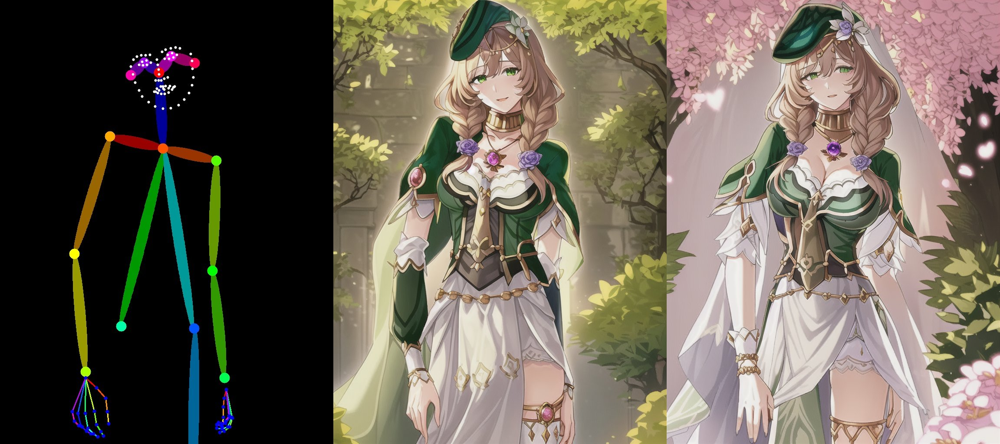
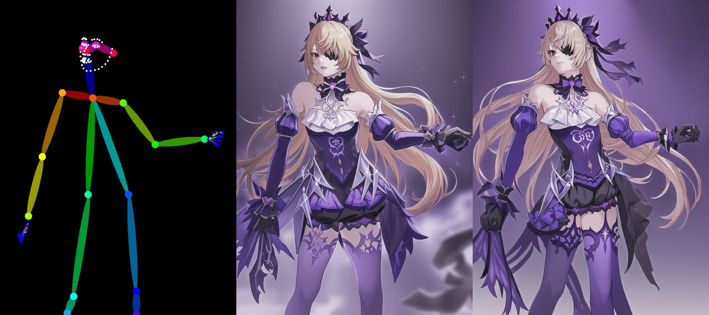
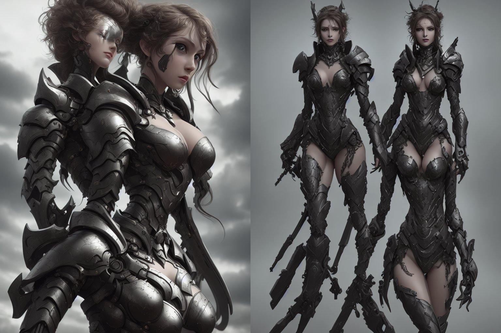
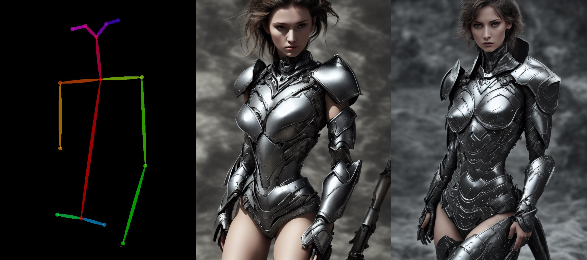
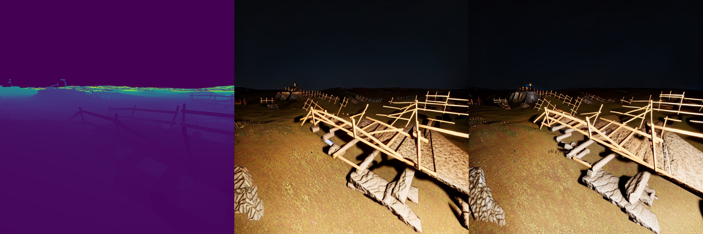

# 🌀 ControlAny-SD1.5

This is our implementation of ControlAny based on [Stable Diffusion 1.5](https://huggingface.co/runwayml/stable-diffusion-v1-5).

> Please refer to [Examples](#examples) for further intuitive details.\
> Please refer to [Inference](#inference) for more details regarding installation and inference.\
> Please refer to [Model Zoo](#model-zoo) for more other our trained models.

Our method demonstrates the advantages listed below:

- **Few trainable parameters**: only requiring **5~30M** trainable parameters (occupying 20~80 MB of memory).
- **Fast training speed**: no sudden convergence.
- **Efficient**: no need for additional brunch; only a lightweight module is required.
- **Compatibility**: can serve as a **plug-and-play** lightweight module and can be combined with other LoRA weights.


# Examples

The demo examples are generated using the ControlAny trained on deepfashion_multiview dataset with utilizing [DreamShaper](https://huggingface.co/Lykon/DreamShaper) as the base model. Our method demonstrates excellent compatibility and can be applied to most other models based on sd1.5 architecture and LoRA. And you can retrain your own model for better performance.

## BaseModel

Our model can be applied to various base models without the need for futher training as a plug-and-play module.
> 📌 Of course, you can retrain your owm model, especially for complex tasks and to achieve better performance.
* [DreamShaper](https://huggingface.co/Lykon/DreamShaper)

<p align="center">
  
</p>

* [Anything-v3.0](https://huggingface.co/admruul/anything-v3.0)

<p align="center">
  
</p>

## LoRA

Our model can also be directly combined with other publicly available LoRA weights.

* [Lisa](https://civitai.com/articles/4584)

<p align="center">
  
</p>

* [Fischl](https://civitai.com/articles/4584)

<p align="center">
  
</p>

* [Chinese Style](https://civitai.com/models/12597/moxin)

<p align="center">
  
</p>

## Stable Generation


Sometimes, it is difficult to generate good results, and you have to repeatedly adjust your prompt to achieve satisfactory outcomes. However, this process is challenging because prompts are very abstract.

Our method can serve as a plug-and-play module for stable generation.

* Without ControlAny (Use original [SD](https://huggingface.co/runwayml/stable-diffusion-v1-5) as base model)
<p align="center">
  
</p>

* With ControlAny (Use original [SD](https://huggingface.co/runwayml/stable-diffusion-v1-5) as base model)
<p align="center">
  
</p>

# Inference

1. Clone our repository
2. `cd ControlAny-SD1.5`
3. Download the pretrained weight into `pretrained/` from [here](https://huggingface.co/Pbihao/ControlAny/tree/main/ControlAny-SD1.5). (Recommended to use `deepfashion_multiview` and `deepfashion_caption`)
5. (Optional) Download the LoRA weight, such as [Genshin](https://civitai.com/models/362091/sd15all-characters-genshin-impact-124-characters-124). And put them under `lora/`
4. Run the scipt

```python
CUDA_VISIBLE_DEVICES=0 python run_controlany.py \
 --pretrained_model_name_or_path="admruul/anything-v3.0" \
 --output_dir="examples/deepfashion_multiview" \
 --validation_image "examples/deepfashion_multiview/condition_0.jpg"  "examples/deepfashion_multiview/condition_1.jpg"  \
 --validation_prompt "fischl_\(genshin_impact\), fischl_\(ein_immernachtstraum\)_\(genshin_impact\), official_alternate_costume, 1girl, eyepatch, detached_sleeves, tiara, hair_over_one_eye, bare_shoulders, purple_dress, white_thighhighs, long_sleeves, hair_ribbon, purple_ribbon, white_pantyhose"  "fischl_\(genshin_impact\), fischl_\(ein_immernachtstraum\)_\(genshin_impact\), official_alternate_costume, 1girl, eyepatch, detached_sleeves, tiara, hair_over_one_eye, bare_shoulders, purple_dress, white_thighhighs, long_sleeves, hair_ribbon, purple_ribbon, white_pantyhose" \
 --negative_prompt "PBH" "PBH"\
 --controlnet_model_name_or_path pretrained/deepfashion_multiview/unet.safetensors \
 (Optional)--lora_path lora/yuanshen/genshin_124.safetensors \
 (Optional)--unet_model_name_or_path pretrained/deepfashion_multiview/unet.safetensors
```

> --pretrained_model_name_or_path : pretrained base model, we try on [DreamShaper](https://huggingface.co/Lykon/DreamShaper), [Anything-v3.0](https://huggingface.co/admruul/anything-v3.0), [ori SD](https://huggingface.co/runwayml/stable-diffusion-v1-5) \
> --controlnet_model_name_or_path : the model path of controlnet (a light weight module) \
> --lora_path : downloaded other LoRA weight \
> --unet_model_name_or_path : the model path of a subset of unet parameters 

> 📌 Pose-based generation is a relative simple task. And in most cases, it is enough to just load the control module by `--controlnet_model_name_or_path`. However, sometime the task is hard so it is need to select some subset of the original unet parameters to fit the task (Can be seen as another kind of LoRA). \
> More parameters mean weaker generality, so you can make your own tradeoff. Or directly train your own models based on your own data. The training is also fast.

# Model Zoo

We also provide some additional examples, but these are just for demonstration purposes. The training data is relatively small and of low quality.

* vidit_depth
<p align="center">
  
</p>

* mask
<p align="center">
  
</p>
