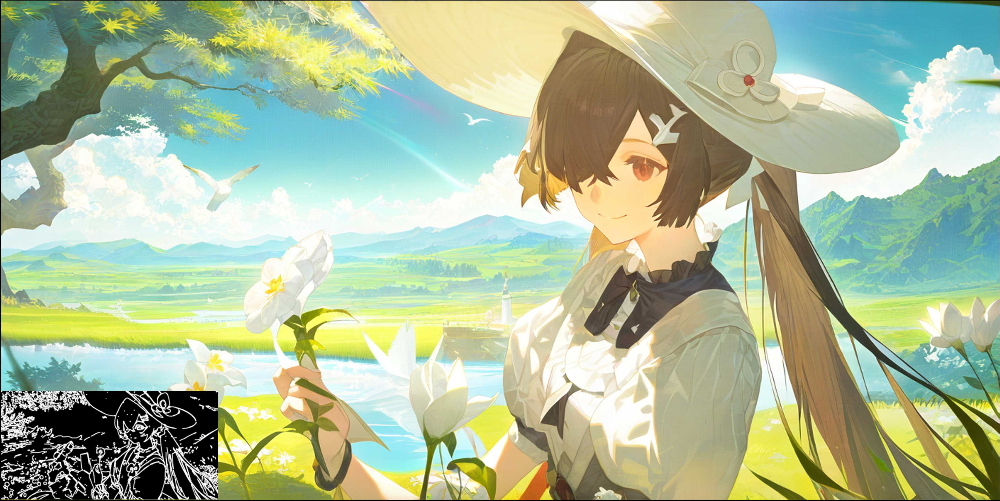
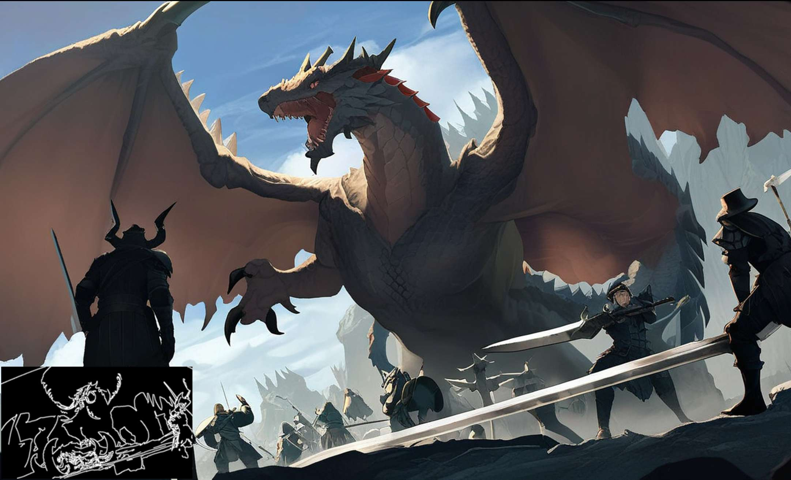
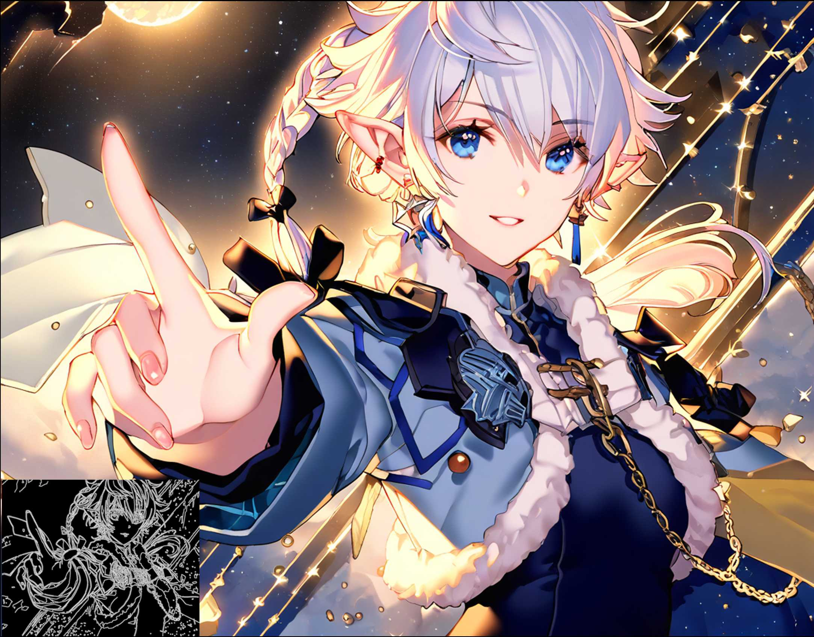
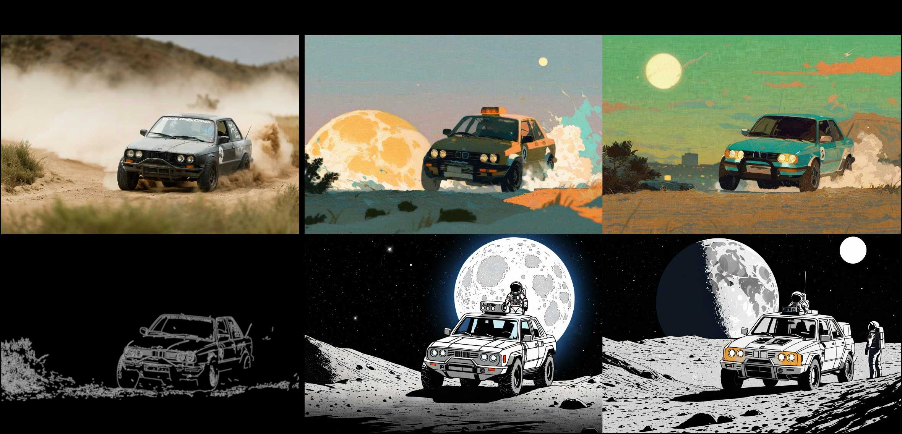
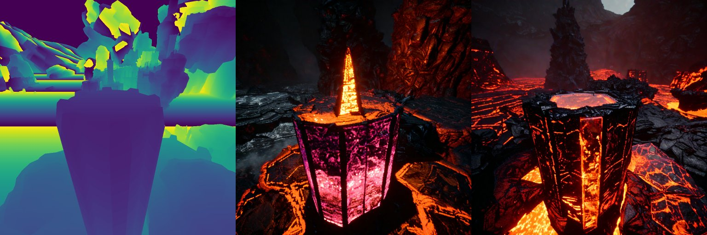
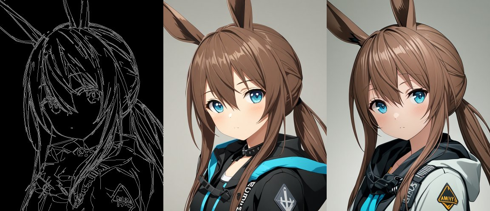
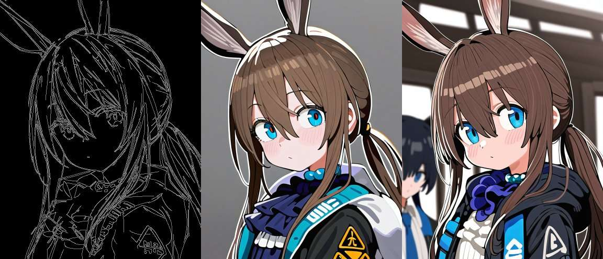
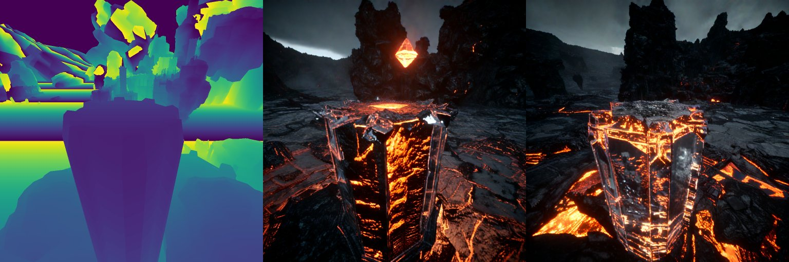

# 🌀 ControlNeXt-SDXL

This is our implementation of ControlNeXt based on [Stable Diffusion XL](stabilityai/stable-diffusion-xl-base-1.0).

> Please refer to [Examples](#examples) for further intuitive details.\
> Please refer to [Inference](#inference) for more details regarding installation and inference.\

Our method demonstrates the advantages listed below:

- **Few trainable parameters**: only requiring **5~200M** trainable parameters.
- **Fast training speed**: reduce sudden convergence.
- **Efficient**: no need for additional brunch; only a lightweight module is required.
- **Compatibility**: can serve as a **plug-and-play** lightweight module and can be combined with other LoRA weights.

# Examples

The demo examples are generated using the ControlNeXt trained on

- (i) our vidit_depth dataset with utilizing [Stable Diffusion XL 1.0 Base](stabilityai/stable-diffusion-xl-base-1.0) as the base model.
- (ii) our anime_canny dataset with utilizing [Neta XL V2](https://civitai.com/models/410737/neta-art-xl) as the base model.

Our method demonstrates excellent compatibility and can be applied to most other models based on SDXL1.0 architecture and LoRA. And you can retrain your own model for better performance.

<p align="center">
  
  
  
  
</p>

## BaseModel

Our model can be applied to various base models without the need for futher training as a plug-and-play module.

> 📌 Of course, you can retrain your owm model, especially for complex tasks and to achieve better performance.

- [Stable Diffusion XL 1.0 Base](stabilityai/stable-diffusion-xl-base-1.0)

<p align="center">
  
</p>

- [AAM XL](https://huggingface.co/Lykon/AAM_XL_AnimeMix)

<p align="center">
  
</p>

- [Neta XL V2](https://civitai.com/models/410737/neta-art-xl)

<p align="center">
  
</p>

## LoRA

Our model can also be directly combined with other publicly available LoRA weights.

- [Glass Sculptures](https://civitai.com/models/11203/glass-sculptures?modelVersionId=177888)

<p align="center">
  
</p>

# Inference

## Quick Start

Clone the repository:

```bash
git clone https://github.com/dvlab-research/ControlNeXt
cd ControlNeXt/ControlNeXt-SDXL
```

Install the required packages:

```bash
pip install -r requirements.txt
```

Download the pretrained weight into `pretrained/` from [here](https://huggingface.co/Pbihao/ControlNeXt/tree/main/ControlAny-SDXL). You can download manually or use the following commands:

```bash
python -m pip install "huggingface_hub[cli]"
mkdir pretrained
huggingface-cli download Pbihao/ControlNeXt ControlAny-SDXL/anime_canny/unet.safetensors ControlAny-SDXL/anime_canny/controlnet.safetensors --local-dir .
mv pretrained/ControlAny-SDXL/* pretrained/
```

(Optional) Download the LoRA weight, such as [Amiya (Arknights) Fresh Art Style](https://civitai.com/models/231598/amiya-arknights-fresh-art-style-xl-trained-with-6k-images). And put them under `lora/`.

Run the example:

```bash
bash examples/anime_canny/run.sh
```

## Usage

### Canny Condition

```python
python run_controlnext.py --pretrained_model_name_or_path "Lykon/AAM_XL_AnimeMix" \
  --unet_model_name_or_path "pretrained/anime_canny/unet.safetensors" \
  --controlnet_model_name_or_path "pretrained/anime_canny/controlnet.safetensors" \
  --controlnet_scale 0.35 \
  --vae_model_name_or_path "madebyollin/sdxl-vae-fp16-fix" \
  --validation_prompt "3d style, photorealistic style, 1girl, arknights, amiya (arknights), solo, white background, upper body, looking at viewer, blush, closed mouth, low ponytail, black jacket, hooded jacket, open jacket, hood down, blue neckwear" \
  --negative_prompt "worst quality, abstract, clumsy pose, deformed hand, fused fingers, extra digits, fewer digits, fewer fingers, extra fingers, extra arm, missing arm, extra leg, missing leg, signature, artist name, multi views, disfigured, ugly" \
  --validation_image "examples/anime_canny/condition_0.png" \
  --output_dir "examples/anime_canny" \
  --load_weight_increasement \
  --variant fp16
```

> --pretrained_model_name_or_path : pretrained base model \
> --unet_model_name_or_path : the model path of a subset of unet parameters \
> --controlnet_model_name_or_path : the model path of controlnet (a light weight module) \
> --controlnet_scale : the strength of the controlnet output. For canny condition, we recommend 0.35 \
> --lora_path : downloaded other LoRA weight \
> --validation_image : the control condition image \

### Depth Condition

```python
python run_controlnext.py  --pretrained_model_name_or_path "stabilityai/stable-diffusion-xl-base-1.0" \
    --unet_model_name_or_path "pretrained/vidit_depth/unet.safetensors" \
    --controlnet_model_name_or_path "pretrained/vidit_depth/controlnet.safetensors" \
    --controlnet_scale 1.0 \
    --vae_model_name_or_path "madebyollin/sdxl-vae-fp16-fix" \
    --validation_prompt "a diamond tower in the middle of a lava lake" \
    --validation_image "examples/vidit_depth/condition_0.png" \
    --output_dir "examples/vidit_depth" \
    --width 1024 \
    --height 1024 \
    --load_weight_increasement \
    --variant fp16
```

> --controlnet_scale : the strength of the controlnet output. For depth, we recommend 1.0 \

## Run with Image Processor

We also provide a simple image processor to help you automatically convert the image to the control condition, such as canny.

```python
python run_controlnext.py --pretrained_model_name_or_path "Lykon/AAM_XL_AnimeMix" \
  --unet_model_name_or_path "pretrained/anime_canny/unet.safetensors" \
  --controlnet_model_name_or_path "pretrained/anime_canny/controlnet.safetensors" \
  --controlnet_scale 0.35 \
  --vae_model_name_or_path "madebyollin/sdxl-vae-fp16-fix" \
  --validation_prompt "3d style, photorealistic style, 1girl, arknights, amiya (arknights), solo, white background, upper body, looking at viewer, blush, closed mouth, low ponytail, black jacket, hooded jacket, open jacket, hood down, blue neckwear" \
  --negative_prompt "worst quality, abstract, clumsy pose, deformed hand, fused fingers, extra digits, fewer digits, fewer fingers, extra fingers, extra arm, missing arm, extra leg, missing leg, signature, artist name, multi views, disfigured, ugly" \
  --validation_image "examples/anime_canny/image_0.png" \
  --validation_image_processor "canny" \
  --output_dir "examples/anime_canny" \
  --load_weight_increasement \
  --variant fp16
```

> --validation_image : the image to be processed to the control condition. \
> --validation_image_processor : the processor to apply to the validation image. We support `canny` now.

# Training

Hardware requirement: A single GPU with at least 20GB memory.

## Quick Start

Clone the repository:

```bash
git clone https://github.com/dvlab-research/ControlNeXt
cd ControlNeXt/ControlNeXt-SDXL
```

Install the required packages:

```bash
pip install -r requirements.txt
pip install accelerate datasets torchvision
```

Run the training script:

```bash
bash examples/anime_canny/train.sh
```

The output will be saved in `train/example`.

## Usage

```python
accelerate launch train_controlnext.py --pretrained_model_name_or_path "stabilityai/stable-diffusion-xl-base-1.0" \
--pretrained_vae_model_name_or_path "madebyollin/sdxl-vae-fp16-fix" \
--variant fp16 \
--use_safetensors \
--output_dir "train/example" \
--logging_dir "logs" \
--resolution 1024 \
--gradient_checkpointing \
--set_grads_to_none \
--proportion_empty_prompts 0.2 \
--controlnet_scale_factor 1.0 \
--mixed_precision fp16 \
--enable_xformers_memory_efficient_attention \
--dataset_name "Nahrawy/VIDIT-Depth-ControlNet" \
--image_column "image" \
--conditioning_image_column "depth_map" \
--caption_column "caption" \
--validation_prompt "a stone tower on a rocky island" \
--validation_image "examples/vidit_depth/condition_0.png"
```

> --pretrained_model_name_or_path : pretrained base model \
> --controlnet_scale_factor : the strength of the controlnet output. For depth, we recommend 1.0, and for canny, we recommend 0.35 \
