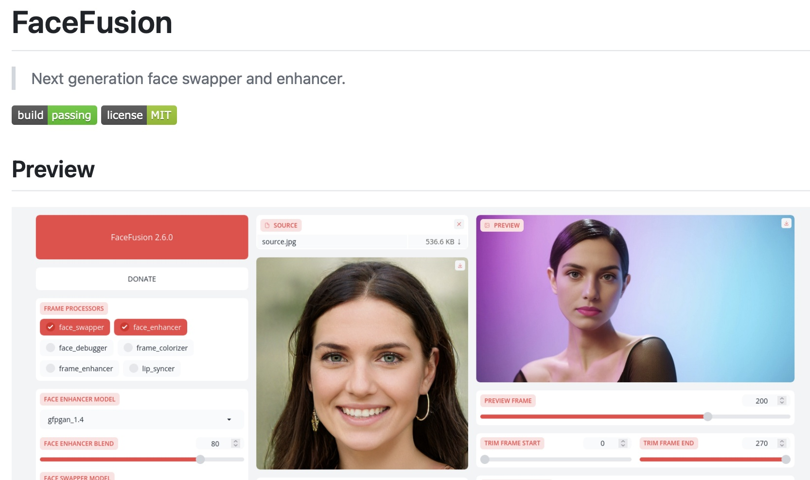

# 🌀 ControlNeXt-SVD-v2

This is our implementation of ControlNeXt based on [Stable Video Diffusion](https://huggingface.co/stabilityai/stable-video-diffusion-img2vid-xt-1-1). It can be seen as an attempt to replicate the implementation of [AnimateAnyone](https://github.com/HumanAIGC/AnimateAnyone) with a more concise and efficient architecture.

Compared to image generation, video generation poses significantly greater challenges. While direct training of the generation model using our method is feasible, we also employ various engineering strategies to enhance performance. Although they are irrespective of academic algorithms.


> Please refer to [Examples](#examples) for further intuitive details.\
> Please refer to [Base model](#base-model) for more details of our used base model. \
> Please refer to [Inference](#inference) for more details regarding installation and inference.\
> Please refer to [Advanced Performance](#advanced-performance) for more details to achieve a better performance.\
> Please refer to [Limitations](#limitations) for more details about the limitations of current work.

# Examples
If you can't load the videos, you can also directly download them from [here](examples/demos) and [here](examples/video).
Or you can view them from our [Project Page](https://pbihao.github.io/projects/controlnext/index.html) or [BiliBili](https://www.bilibili.com/video/BV1wJYbebEE7/?buvid=YC4E03C93B119ADD4080B0958DE73F9DDCAC&from_spmid=dt.dt.video.0&is_story_h5=false&mid=y82Gz7uArS6jTQ6zuqJj3w%3D%3D&p=1&plat_id=114&share_from=ugc&share_medium=iphone&share_plat=ios&share_session_id=4E5549FC-0710-4030-BD2C-CDED80B46D08&share_source=WEIXIN&share_source=weixin&share_tag=s_i&timestamp=1723123770&unique_k=XLZLhCq&up_id=176095810&vd_source=3791450598e16da25ecc2477fc7983db).

<table style="margin: 0 auto; border-collapse: collapse;">
    <tr>
        <td width="40%" style="border: none;">
            <video width="100%" height="auto" style="display: block; margin: 0px auto;" controls autoplay loop src="https://github.com/user-attachments/assets/9d45a00a-d3cd-48e1-aa78-1d3158bfd4f4" muted="false"></video>
        </td>
        <td width="40%" style="border: none;">
            <video width="100%" height="auto" style="display: block; margin: 0px auto;" controls autoplay loop src="https://github.com/user-attachments/assets/1004960a-82de-4f0d-a329-ba676b8cbd0d" muted="false"></video>
        </td>
    </tr>
    <tr>
        <td width="40%" style="border: none;">
            <video width="100%" height="auto" style="display: block; margin: 0px auto;" controls autoplay loop src="https://github.com/user-attachments/assets/7db1acd1-0c61-4855-91bb-e4e8f8989393" muted="false"></video>
        </td>
        <td width="40%" style="border: none;">
            <video width="100%" height="auto" style="display: block; margin: 0px auto;" controls autoplay loop src="https://github.com/user-attachments/assets/0f32df53-1827-404d-806a-23e65d357504" muted="false"></video>
        </td>
    </tr>

</table>

<video width="80%" height="auto" style="display: block; margin: 0px auto;" controls autoplay loop src="https://github.com/user-attachments/assets/c69b4f34-0851-4637-a9ef-fb91beed5666" muted="false"></video>

<video width="80%" height="auto" style="display: block; margin: 0px auto;" controls autoplay loop src="https://github.com/user-attachments/assets/32a4d24b-bc39-4ea9-9fd4-ed78b4eec116" muted="false"></video>


# Base Model

For the v2 version, we adopt the below operations to improve the performance:
* We have collected a higher-quality dataset with higher resolution to train our model.
* We have extended the training and inference batch frames to 24.
* We have extended the video height and width to a resolution of 576 × 1024.
* We conduct extensive continual training of SVD on human-related videos to enhance its ability to generate human-related content.
* We adopt fp32.
* We adopt the pose alignment during the inference following the related.

# Inference

1. Clone our repository
2. `cd ControlNeXt-SVD-v2`
3. Download the pretrained weight into `pretrained/` from [here](https://huggingface.co/Pbihao/ControlNeXt/tree/main/ControlNeXt-SVD/v2). (More details please refer to [Base Model](#base-model))
4. Download the DWPose weights including the [dw-ll_ucoco_384](https://drive.google.com/file/d/12L8E2oAgZy4VACGSK9RaZBZrfgx7VTA2/view?usp=sharing) and [yolox_l](https://drive.google.com/file/d/1w9pXC8tT0p9ndMN-CArp1__b2GbzewWI/view?usp=sharing) into `pretrained/DWPose`. For more details, please refer to [DWPose](https://github.com/IDEA-Research/DWPose):
```
├───pretrained
│   └───DWPose
│     │───dw-ll_ucoco_384.onnx
│     └───yolox_l.onnx
│
├───unet.bin
└───controlnet.bin
```
5. Run the scipt

```bash
CUDA_VISIBLE_DEVICES=0 python run_controlnext.py \
  --pretrained_model_name_or_path stabilityai/stable-video-diffusion-img2vid-xt-1-1 \
  --output_dir outputs \
  --max_frame_num 240 \
  --guidance_scale 3 \
  --batch_frames 24 \
  --sample_stride 2 \
  --overlap 6 \
  --height 1024 \
  --width 576 \
  --controlnext_path pretrained/controlnet.bin \
  --unet_path pretrained/unet.bin \
  --validation_control_video_path examples/video/02.mp4 \
  --ref_image_path examples/ref_imgs/01.jpeg
```

> --pretrained_model_name_or_path : pretrained base model, we pretrain and fintune models based on [SVD-XT1.1](https://huggingface.co/stabilityai/stable-video-diffusion-img2vid-xt-1-1)\
> --controlnet_model_name_or_path : the model path of controlnet (a light weight module) \
> --unet_model_name_or_path : the model path of unet \
> --ref_image_path: the path to the reference image \
> --overlap: The length of the overlapped frames for long-frame video generation. \
> --sample_stride: The length of the sampled stride for the conditional controls.

5. Face Enhancement (Optional，Recommand for bad faces)

> Currently, the model is not specifically trained for IP consistency, as there are already many mature tools available. Additionally, alternatives like Animate Anyone also adopt such post-processing techniques. 

a. Clone [Face Fusion](https://github.com/facefusion/facefusion): \
```git clone https://github.com/facefusion/facefusion```

b. Ensure to enter the directory:\
```cd facefusion```

c. Install facefusion (Recommand create a new virtual environment using conda to avoid conflicts):\
```python install.py```

d. Run the command:
```
python run.py \
  -s ../outputs/demo.jpg \
  -t ../outputs/demo.mp4 \
  -o ../outputs/out.mp4 \
  --headless \
  --execution-providers cuda  \
  --face-selector-mode one 
```

> -s: the reference image \
> -t: the path to the original video\
> -o: the path to store the refined video\
> --headless: no gui need\
> --execution-providers cuda: use cuda for acceleration (If available, most the cpu is enough)

# Advanced Performance
In this section, we will delve into additional details and my own experiences to enhance video generation. These factors are algorithm-independent and unrelated to academia, yet crucial for achieving superior results. Many closely related works incorporate these strategies.

### Reference Image

It is crucial to ensure that the reference image is clear and easily understandable, especially aligning the face of the reference with the pose.


### Face Enhencement

Most related works utilize face enhancement as part of the post-processing. This is especially relevant when generating videos based on images of unfamiliar individuals, such as friends, who were not included in the base model's pretraining and are therefore unseen and OOD data.

We recommand the [Facefusion](https://github.com/facefusion/facefusion
) for the post proct-processing. And please let us know if you have a better solution.

Please refer to [Facefusion](https://github.com/facefusion/facefusion
) for more details.




### Continuously Finetune

To significantly enhance performance on a specific pose sequence, you can continuously fine-tune the model for just a few hundred steps. 

We will release the related fine-tuning code later.

### Pose Generation

We adopt [DWPose](https://github.com/IDEA-Research/DWPose) for the pose generation, and follow the related work ([1](https://humanaigc.github.io/animate-anyone/), [2](https://tencent.github.io/MimicMotion/)) to align the pose.

# Limitations

## IP Consistency

We did not prioritize maintaining IP consistency during the development of the generation model and now rely on a helper model for face enhancement. 

However, additional training can be implemented to ensure IP consistency moving forward.

This also leaves a possible direction for futher improvement.

## Base model

The base model plays a crucial role in generating human features, particularly hands and faces. We encourage collaboration to improve the base model for enhanced human-related video generation.

# TODO

* Training and finetune code
