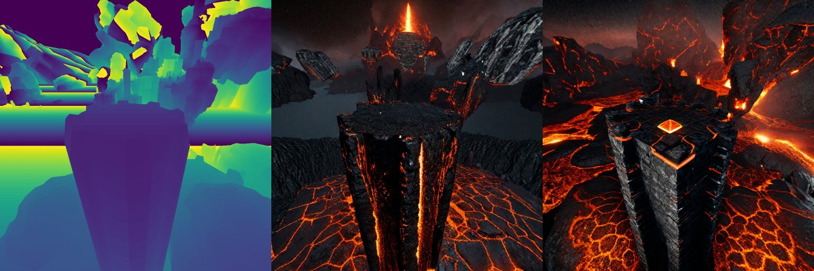
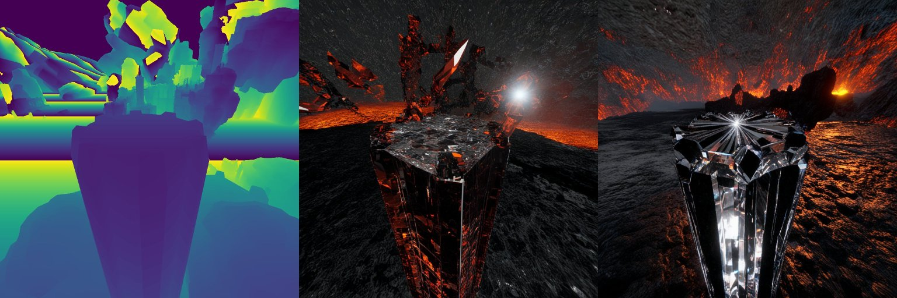

# 🌀 ControlAny
**ControlAny** is our official implementation for controllable generation, supporting both images and videos while incorporating diverse forms of control information. In this project, we propose a new method that reduces trainable parameters by up to 90% compared with ControlNet, achieving faster convergence and outstanding efficiency. This method can be directly combined with other LoRA techniques to alter style and ensure more stable generation. Please refer to the examples for more details.

> 📢 We are initially releasing our code with weights, and further details will be presented in our upcoming paper. Please stay tuned for updates.

> This project is still undergoing iterative development. The code and model may be updated at any time.

# Model Zoo

- **ControlAny-SVD** [ [Link](ControlAny-SVD) ] :  Generate the video controlled by the sequence of human poses. This can be seen as an attempt to replicate the implementation of [AnimateAnyone](https://github.com/HumanAIGC/AnimateAnyone). However, our model is built upon [Stable Video Diffusion](https://stability.ai/stable-video), employing a more concise architecture.

- **ControlAny-SD1.5** [ [Link](ControlAny-SD1.5) ] : Controllable image generation. Our model is built upon [Stable Diffusion 1.5](https://huggingface.co/runwayml/stable-diffusion-v1-5). Fewer trainable parameters, faster convergence, improved efficiency, and can be integrated with LoRA.

- **ControlAny-SDXL** [ [Link](ControlAny-SDXL) ] : Controllable image generation. Our model is built upon [Stable Diffusion XL ](stabilityai/stable-diffusion-xl-base-1.0). Fewer trainable parameters, faster convergence, improved efficiency, and can be integrated with LoRA.

- **ControlAny-SD1.5** [ [Link](ControlAny-SD3) ] : Stay tuned.

- **ControlNet-CN** [ [Link](ControlNet-CN) ] : Stay tuned.

# 🎥 Examples

### [ControlAny-SD1.5](ControlAny-SD1.5)

  

  

  

### [ControlAny-SDXL](ControlAny-SDXL)

  

  

